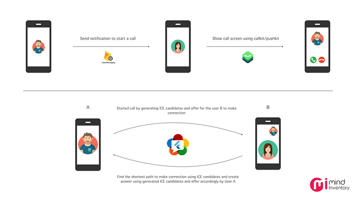

# flutter_web_rtc_with_call_kit

Flutter example of webrtc with callkit for Android and iOS.

* WebRTC (Web Real-Time Communication) is a powerful framework that allows for peer-to-peer
  communication between web browsers and mobile apps, enabling features like audio and video
  calling, screen sharing, and file transfer.

* CallKit is an Apple framework designed to enable seamless integration of audio and video calling
  services into our apps. It provides a native-like calling interface, improving the user experience
  by mimicking the look and feel of the system's Phone app.

Check out our blog to learn how we built this: [Integrating Flutter WebRTC with CallKit for Seamless
Communication.](https://medium.com/mindful-engineering/Integrating-Flutter-WebRTC-with-CallKit-for-Seamless-Communication)

# Flowchart to get a clear understanding of the entire process

1. Call Initiation: User A starts a video call with User B.
2. Signaling: A signaling server facilitates the exchange of SDP and ICE candidates between User A
   and User B to establish a connection.
3. Connection Setup: Once signaling is complete, WebRTC captures and transmits audio and video data
   between the devices of User A and User B.
4. Incoming Call Notification: User B's device receives the incoming call, and CallKit displays a
   system notification, allowing the user to accept or decline.
5. Call Handling: If User B accepts, CallKit informs the Flutter app, which then establishes the
   WebRTC-based audio and video connection between the devices.
6. In-Call Experience: The video call is displayed in the app's interface, with controls for muting
   audio or video, or ending the call.

# Preview

<table>
  <tr>
    <td></td>
    <td></td>
    <td></td>
    <td></td>
  </tr>
  <tr>
    <td></td>
    <td></td>
    <td></td>
    <td></td>
  </tr>
</table>

# Usage Instructions

To run this example on your system, follow these steps:

* Clone the Repository
* Set Up Firebase
    * Create a Firebase project and configure it for Android and iOS.
* Replace Firebase Config Files
    * Dart: Replace `firebase_options.dart`, `firebase.json`
    * Android: Replace `google-services.json`
    * iOS: Replace `GoogleService-Info.plist`
* Add Service Account JSON
    * Add your Firebase service account JSON to the assets folder.
    * Replace the firebaseConfig with your JSON file in the `app_assets.dart`
* Update FCM Helper
    * Replace the projectId in the `fcm_helper.dart` with your Firebase project ID.

# Dependencies

* [flutter_webrtc](https://pub.dev/packages/flutter_webrtc)
* [flutter_callkit_incoming](https://pub.dev/packages/flutter_callkit_incoming)
* [firebase_core](https://pub.dev/packages/firebase_core)
* [cloud_firestore](https://pub.dev/packages/cloud_firestore)
* [firebase_messaging](https://pub.dev/packages/firebase_messaging)

# References

* https://www.youtube.com/watch?v=hAKQzNQmNe0z
* https://github.com/md-weber/webrtc_tutorial

# LICENSE!

**flutter_web_rtc_with_call_kit**
is [MIT-licensed.](https://github.com/Mindinventory/flutter_web_rtc_with_call_kit/blob/main/LICENSE)

# Let us know!

We’d be really happy if you send us links to your projects where you use our open-source libraries.
Just send an email to [sales@mindinventory.com](mailto:sales@mindinventory.com) And do let us know
if you have any questions or suggestion regarding our work.

Visit our website [mindinventory.com](https://www.mindinventory.com)

Let us know if you are interested to building Apps or Designing Products.

