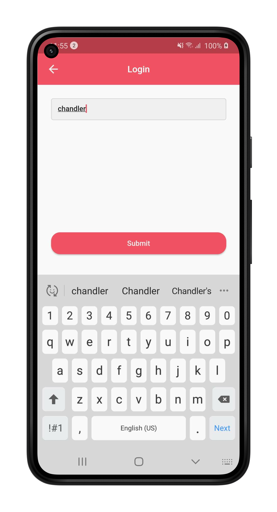
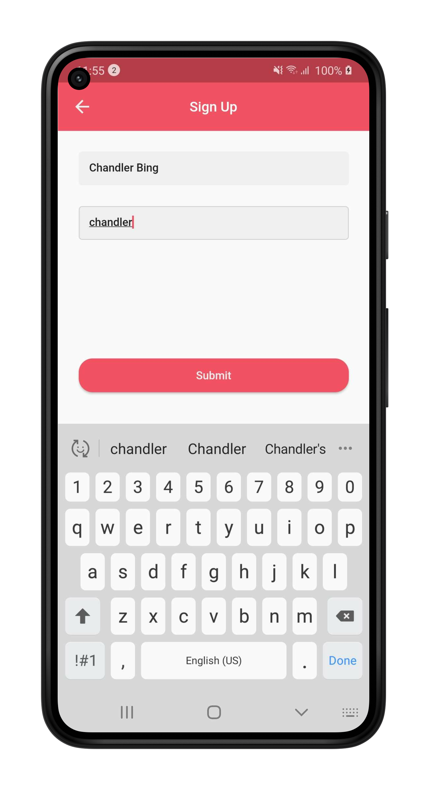
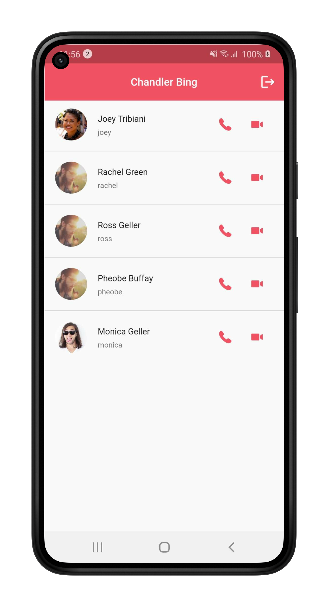
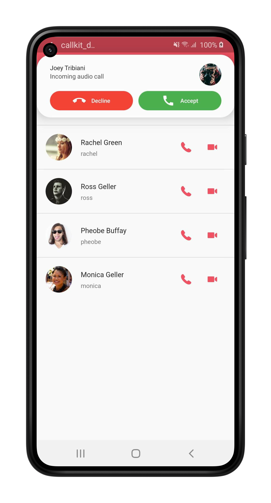
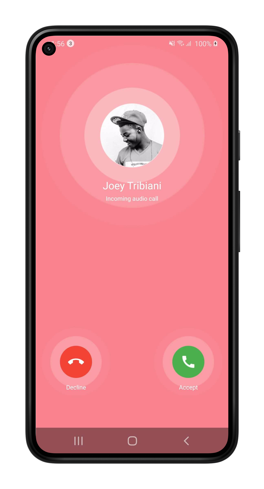
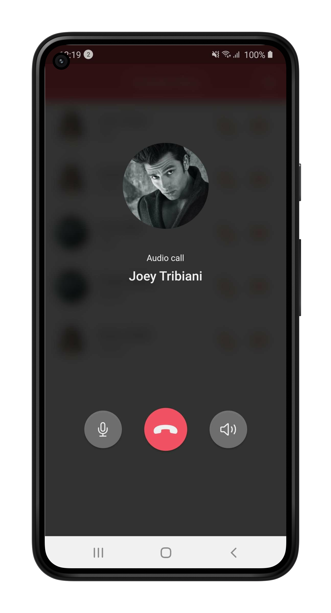
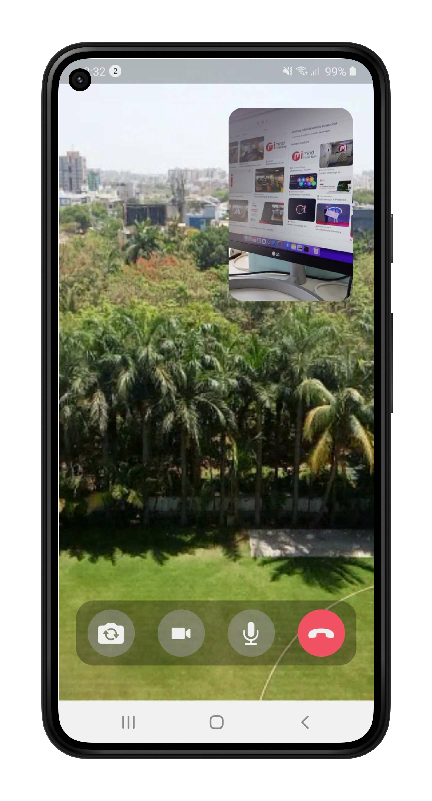

# flutter_web_rtc_with_call_kit

Flutter example of webrtc with callkit for Android and iOS.

# Preview

<table>
  <tr>
    <td></td>
    <td></td>
    <td></td>
    <td></td>
  </tr>
  <tr>
    <td></td>
    <td></td>
    <td></td>
    <td></td>
  </tr>
 </table>
