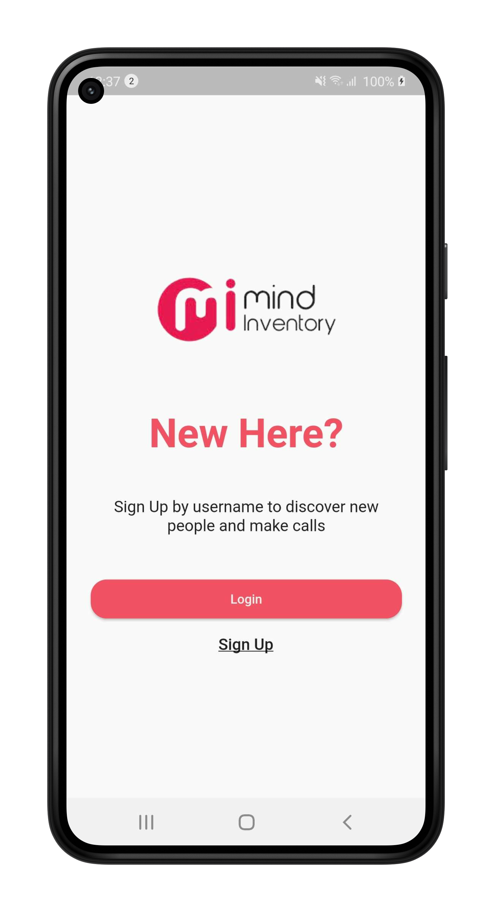

# flutter_web_rtc_with_call_kit

Flutter example of webrtc with callkit for Android and iOS.

# Preview

<table>
  <tr>
    <td></td>
    <td></td>
    <td></td>
    <td></td>
  </tr>
  <tr>
    <td></td>
    <td></td>
    <td></td>
    <td></td>
  </tr>
 </table>

## Let us know!

We’d be really happy if you send us links to your projects where you use our open-source libraries.
Just send an email to [sales@mindinventory.com](mailto:sales@mindinventory.com) And do let us know
if you have any questions or suggestion regarding our work.

Visit our website [mindinventory.com](https://www.mindinventory.com)

Let us know if you are interested to building Apps or Designing Products.

